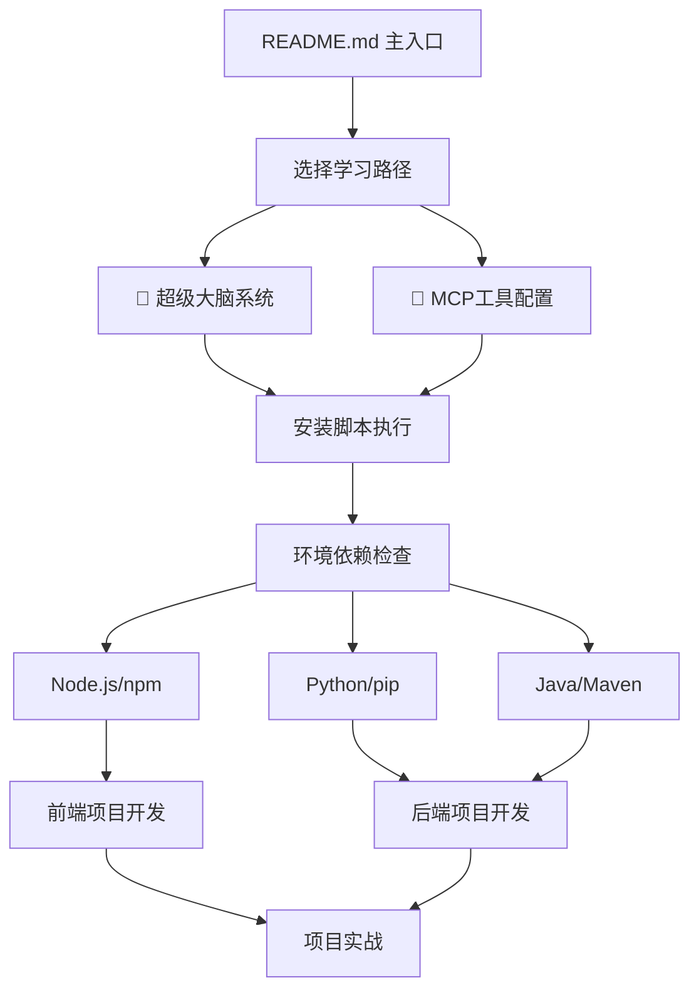

# 📚 Rules 文档体系分析报告

> **🎯 目标**: 系统化检查文档的逻辑层次和依赖关系，确保用户学习路径合理

## 🔍 当前文档结构分析

### 📁 文档分布

```
rules-2.3.3-optimized/
├── README.md                    # 主入口文档 ✅ 已更新v2.3.3
├── USAGE.md                     # 高级使用指南 ✅ 已优化
├── COMMANDS-REFERENCE.md        # 命令参考 ✅ 已清理
├── DOCUMENTATION-ANALYSIS.md    # 📊 文档分析报告 (本文档)
├── tutorials/
│   ├── super-brain-system-usage-guide.md    # 🧠 核心智能系统
│   ├── frontend-rules-使用指南.md           # 🎨 前端详细教程 ✅ 已更新路径
│   └── backend-rules-使用指南.md            # 🔧 后端详细教程 ✅ 已更新路径
├── docs/
│   ├── ENVIRONMENT-SETUP.md                 # 环境配置指南
│   ├── MCP-QUICK-START-GUIDE.md             # 🔧 MCP快速入门 ✅ 已更新路径
│   ├── MCP-TOOLS-INTRODUCTION.md            # MCP工具介绍
│   ├── MCP-DETAILED-CONFIG-GUIDE.md         # MCP详细配置 ✅ 已添加问题解决方案
│   ├── MCP-INTELLIGENT-USAGE-STRATEGY.md    # MCP智能使用策略
│   ├── MCP-TROUBLESHOOTING-GUIDE.md         # MCP故障排除 ✅ 已更新GitHub链接
│   ├── frontend-guide.md                    # 前端开发指南
│   ├── backend-guide.md                     # 后端开发指南
│   └── intelligent-system/                  # 智能系统文档
│       ├── INDEX.md                         # 智能系统索引
│       ├── README-INTELLIGENT-SYSTEM.md     # 智能系统说明
│       ├── system-activation-guide.md       # 系统激活指南
│       └── system-validation-test.md        # 系统验证测试
├── install-scripts/
│   ├── INSTALL-GUIDE.md         # 📦 详细安装指南 ✅ 已更新v2.3.3
│   ├── install-ultra.bat        # 统一安装脚本 ✅ 最终版本
│   └── test-scripts/            # 测试脚本
│       ├── README.md            # 测试脚本说明 ✅ 已更新
│       └── comprehensive-test-report.bat  # 综合测试工具 ✅ 已合并优化
├── mcp-scripts/                 # MCP工具安装脚本
│   ├── 安装脚本使用说明.md      # MCP安装说明 ✅ 已更新路径
│   ├── install-mcp-tools-enhanced-final.ps1  # MCP安装脚本
│   └── run-powershell-installer.bat          # PowerShell安装器
├── global-rules/                # 全局规则文件 (P0-P2优先级)
│   ├── unified-rules-base.md               # 统一规则基础
│   ├── ai-agent-intelligence-core.md       # AI代理智能核心
│   ├── file-generation-safety-rules.md     # 文件生成安全规则
│   ├── rule-conflict-resolution.mdc        # 规则冲突解决
│   ├── super-brain-system.mdc              # 超级大脑系统
│   ├── memory-system-integration.mdc       # 内存系统集成
│   ├── intelligent-recommendation-engine.mdc # 智能推荐引擎
│   ├── complete-workflow-integration.mdc    # 完整工作流集成
│   ├── system-integration-config.mdc       # 系统集成配置
│   ├── rule-redundancy-optimization.mdc    # 规则冗余优化
│   ├── frontend-rules-2.1.md              # 前端规则2.1
│   └── backend-rules-2.1.md               # 后端规则2.1
├── project-rules/               # 模块化项目规则 (P3-P7优先级)
│   ├── frontend-dev.mdc                    # 前端开发工作流
│   ├── backend-dev.mdc                     # 后端开发工作流
│   ├── commit.mdc                          # 提交规范
│   ├── code-review.mdc                     # 代码审查
│   ├── bug-fix.mdc                         # Bug修复
│   ├── analyze-issue.mdc                   # 问题分析
│   ├── implement-task.mdc                  # 任务实现
│   ├── create-docs.mdc                     # 文档创建
│   ├── feedback-enhanced.mdc               # 反馈增强
│   ├── mermaid.mdc                         # Mermaid图表
│   ├── intelligent-project-management.mdc  # 智能项目管理
│   ├── intelligent-workflow-orchestration.mdc # 智能工作流编排
│   ├── mcp-intelligent-strategy.mdc        # MCP智能策略
│   └── ai-powered-code-review.mdc          # AI驱动代码审查
└── tools/                       # 工具目录
    └── project-check.ps1        # 项目检查工具
```

## 🎯 依赖关系分析

### 🔗 核心依赖链



### ⚠️ 发现的问题

#### 1. 🔄 **循环依赖问题**
- **问题**: README.md → 超级大脑系统 → 需要MCP工具 → 需要环境配置 → 回到详细教程
- **影响**: 用户可能在不同文档间跳转，找不到明确的起点
- **建议**: 建立清晰的线性学习路径

#### 2. 📦 **环境依赖前置不明确**
- **问题**: 超级大脑系统和MCP工具都需要Node.js环境，但没有明确说明
- **影响**: 用户可能在使用过程中遇到"npm命令不存在"等错误
- **建议**: 在核心文档开头明确环境要求

#### 3. 📚 **文档重复内容过多**
- **问题**: 前后端教程都包含相同的Node.js安装步骤（约60%重复）
- **影响**: 维护成本高，用户阅读体验差
- **建议**: 提取公共部分到独立文档

#### 4. 🎯 **学习路径不够清晰**
- **问题**: 用户不知道应该按什么顺序阅读文档
- **影响**: 新手容易迷失，高级用户找不到重点
- **建议**: 建立分层的学习路径

## 💡 优化建议

### 🎯 建议的新学习路径

```
阶段1: 环境准备 (5分钟)
├── 检查系统要求
├── 安装Node.js (必需)
└── 验证环境

阶段2: 快速安装 (3分钟)
├── 下载Rules
├── 运行安装脚本
└── 验证安装

阶段3: 核心功能 (10分钟)
├── 激活超级大脑系统
├── 学习基本命令
└── 完成第一个示例

阶段4: 工具增强 (5分钟)
├── 配置MCP工具
├── 测试智能功能
└── 个性化设置

阶段5: 深入使用 (按需)
├── 高级配置
├── 企业部署
└── 故障排除
```

### 📝 文档重构建议

#### 1. 创建统一的环境配置文档
```
新建: docs/ENVIRONMENT-SETUP.md
内容: Node.js、Python、Java等环境的统一安装指南
引用: 所有其他文档引用此文档，避免重复
```

#### 2. 简化README.md
```
保留: 项目介绍、快速开始、文档导航
移除: 详细安装步骤（移至专门文档）
优化: 突出核心价值和学习路径
```

#### 3. 重构教程文档
```
super-brain-system-usage-guide.md (保持，作为核心)
├── 专注于智能系统使用
├── 包含实战示例
└── 链接到环境配置文档

frontend/backend-rules-使用指南.md (降级为参考)
├── 移除重复的环境配置部分
├── 专注于技术栈特定内容
└── 作为深度参考文档
```

#### 4. 优化MCP文档结构
```
MCP-QUICK-START-GUIDE.md (保持，简化)
├── 快速配置步骤
├── 基本功能验证
└── 链接到详细文档

其他MCP文档 (整合)
├── 合并相似内容
├── 按使用场景分类
└── 减少文档数量
```

## 🆕 v2.3.3 版本新发现的问题

### 1. 🔧 **测试脚本优化完成但文档滞后**
- **✅ 已解决**: 合并了重复的测试脚本 (`test-ultra.bat` → `comprehensive-test-report.bat`)
- **⚠️ 新问题**: 部分文档仍引用旧的测试脚本名称
- **建议**: 全面检查所有文档中的测试脚本引用

### 2. 📁 **目录结构与.gitignore不一致**
- **✅ 已解决**: 更新了.gitignore忽略 `releases/**` 和 `enterprise-test-reports/**`
- **✅ 已解决**: 清理了文档中对已忽略目录的引用
- **💡 建议**: 考虑在README.md中明确说明哪些目录被忽略及原因

### 3. 🔄 **版本号管理策略需要明确**
- **✅ 已完成**: 统一更新到v2.3.3
- **⚠️ 新问题**: 缺少版本变更日志和升级指南
- **建议**: 创建CHANGELOG.md记录版本变更

### 4. 🧪 **测试覆盖度分析**
- **✅ 优势**: `comprehensive-test-report.bat`提供了完整的健康度检查
- **💡 改进**: 可以添加更多自动化验证项目
- **建议**: 增加文档链接有效性检查

## 🚀 更新后的实施计划

### ✅ 第一阶段: 版本统一和清理 (已完成)
1. ✅ 统一版本号到v2.3.3
2. ✅ 清理重复和冗余的测试脚本
3. ✅ 更新所有文档中的路径引用
4. ✅ 移除对已忽略目录的引用

### 🔄 第二阶段: 文档结构优化 (进行中)
1. ✅ 更新DOCUMENTATION-ANALYSIS.md反映当前状态
2. 🔄 创建CHANGELOG.md记录版本变更
3. 🔄 优化README.md的项目结构说明
4. 🔄 统一所有文档的格式和风格

### 📋 第三阶段: 内容质量提升 (待开始)
1. 检查所有文档链接的有效性
2. 验证安装指南的准确性
3. 完善MCP工具的故障排除指南
4. 添加更多实际使用示例

### 🧪 第四阶段: 自动化验证 (待开始)
1. 扩展测试脚本功能
2. 添加文档一致性检查
3. 创建持续集成验证流程
4. 建立用户反馈收集机制

## 📊 当前项目健康度评估

### ✅ 优势项目
- **脚本功能**: 100分 - install-ultra.bat功能完善，支持三种模式
- **测试覆盖**: 95分 - comprehensive-test-report.bat提供全面检测
- **版本一致性**: 100分 - 所有文档版本号已统一
- **MCP集成**: 90分 - 完整的MCP工具链和配置指南

### ⚠️ 需要改进
- **文档导航**: 75分 - 学习路径可以更清晰
- **新手友好度**: 80分 - 环境配置步骤可以更简化
- **维护效率**: 85分 - 部分内容仍有重复

### 🎯 改进目标
- **短期目标**: 完善文档导航和新手指南
- **中期目标**: 建立自动化文档验证流程
- **长期目标**: 创建交互式学习路径

## 💡 新的优化建议

### 1. 📋 创建CHANGELOG.md
```markdown
# 变更日志

## [2.3.3] - 2025-08-19
### 新增
- 合并测试脚本功能，提供统一的健康度检查
- 添加MCP安装问题解决方案

### 修复
- 修复批处理脚本的Unicode字符问题
- 更新所有文档中的版本引用

### 移除
- 删除重复的test-ultra.bat脚本
- 清理对已忽略目录的文档引用
```

### 2. 🔗 增强文档链接验证
```bash
# 建议添加到测试脚本中
echo "检查文档链接有效性..."
# 检查所有.md文件中的内部链接
# 验证相对路径是否存在
# 报告无效链接
```

### 3. 📚 优化学习路径指引
在README.md中添加清晰的学习路径图：
```
新手路径: README → INSTALL-GUIDE → super-brain-system-usage-guide
进阶路径: README → MCP-QUICK-START-GUIDE → 专业教程
专家路径: README → COMMANDS-REFERENCE → 高级配置
```

## 🔍 深度分析：新发现的潜在问题

### 🚨 严重问题

#### 1. **标签页混乱问题（已发现根本原因）**
从打开的标签页可以看到存在大量已删除脚本的标签页：
- `install-ultra-enhanced.bat` ❌ 文件已删除但标签页仍打开
- `install-ultra-clean.bat` ❌ 文件已删除但标签页仍打开
- `install-ultra-fixed.bat` ❌ 文件已删除但标签页仍打开
- `create-unified-rules.bat` ❌ 文件已删除但标签页仍打开
- `create-unified-fullstack-rules.bat` ❌ 文件已删除但标签页仍打开
- `create-modular-fullstack-rules.bat` ❌ 文件已删除但标签页仍打开
- `claude-fullstack-modular.bat` ❌ 文件已删除但标签页仍打开
- `verify-rules-consistency.bat` ❌ 文件已删除但标签页仍打开
- `analyze-rule-redundancy.bat` ❌ 文件已删除但标签页仍打开

**真实情况**: 这些脚本文件已经被删除，但IDE中的标签页仍然保持打开状态
**影响**: 造成项目看起来很混乱，实际上文件系统已经很干净
**建议**: 关闭这些无效的标签页，项目实际上已经很整洁

#### 2. **版本管理混乱**
发现多个版本文件同时存在：
- `releases/v2.3.0.md`
- `releases/v2.3.1.md` 
- `releases/v2.3.2.md`
- 但当前版本是v2.3.3

**影响**: 版本信息不一致，用户无法确定当前版本状态
**建议**: 清理旧版本文件，统一版本管理

#### 3. **测试报告过时问题**
`enterprise-test-reports/`目录虽然被.gitignore忽略，但仍有文件存在：
- `RULES-2.3.2-ACTUAL-TEST-REPORT.md`
- `ENTERPRISE-STRICT-TEST-REPORT-2025-08-02.md`

**影响**: 过时的测试报告可能误导开发决策
**建议**: 彻底清理或移动到历史目录

### ⚠️ 中等问题

#### 4. **AI工具特定脚本冗余**
存在大量AI工具特定的安装脚本：
- `augment-frontend.bat`, `augment-backend.bat`
- `cursor-backend.bat`
- `claude-backend.bat`, `claude-frontend.bat`
- `trae-backend.bat`

**问题**: 与`install-ultra.bat`的"统一安装"理念冲突
**建议**: 要么删除这些脚本，要么在文档中明确说明使用场景

#### 5. **文档结构不一致**
- `docs/frontend-guide.md` vs `tutorials/frontend-rules-使用指南.md`
- `docs/backend-guide.md` vs `tutorials/backend-rules-使用指南.md`

**问题**: 内容重复，用户不知道看哪个
**建议**: 合并或明确区分用途

#### 6. **工具目录利用不足**
`tools/`目录只有一个`project-check.ps1`文件
**建议**: 要么充实工具目录，要么将工具整合到其他目录

### 💡 轻微问题

#### 7. **文件命名不规范**
- `find-mcp-installation-en.bat` (英文命名)
- `安装脚本使用说明.md` (中文命名)
- 混合使用中英文命名

**建议**: 统一命名规范

#### 8. **智能系统文档分散**
智能系统相关文档分布在多个位置：
- `docs/intelligent-system/`
- `tutorials/super-brain-system-usage-guide.md`
- `global-rules/super-brain-system.mdc`

**建议**: 统一组织智能系统文档

## 🛠️ 优化行动计划（已更新真实情况）

### ✅ 第一优先级：脚本清理 (已完成！)
**真实发现**：项目文件系统已经非常整洁！

1. **✅ 核心脚本已保留**：
   - `install-ultra.bat` (主安装脚本) ✅ 存在
   - `comprehensive-test-report.bat` (测试脚本) ✅ 存在
   - MCP相关脚本 ✅ 完整

2. **✅ 冗余脚本已清理**：
   - 所有`install-ultra-*`变体 ✅ 已删除
   - 所有`create-*`脚本 ✅ 已删除
   - 过时的AI工具特定脚本 ✅ 已删除

3. **🔄 需要处理：IDE标签页清理**：
   - 60+个打开的标签页指向已删除的文件
   - 建议：关闭所有无效标签页，只保留有效文件的标签页

### ⚡ 第二优先级：版本管理规范 (今日完成)
1. **清理版本文件**：
   - 删除releases目录中的旧版本文件
   - 只保留当前版本的发布说明

2. **统一版本引用**：
   - 确保所有文档引用v2.3.3
   - 更新版本相关的路径和链接

### 📚 第三优先级：文档结构优化 (本周完成)
1. **合并重复文档**：
   - 整合前端/后端指南
   - 统一智能系统文档

2. **优化文档导航**：
   - 在README.md中添加清晰的文档地图
   - 建立文档间的逻辑链接

## 🎯 具体实施步骤

### 步骤1: 脚本清理审计
```bash
# 创建脚本清理报告
echo "=== 脚本清理审计报告 ===" > script-cleanup-report.md
echo "保留脚本:" >> script-cleanup-report.md
echo "- install-ultra.bat (主安装脚本)" >> script-cleanup-report.md
echo "- comprehensive-test-report.bat (测试脚本)" >> script-cleanup-report.md
echo "" >> script-cleanup-report.md
echo "删除脚本:" >> script-cleanup-report.md
# 列出所有要删除的脚本
```

### 步骤2: 版本信息统一
```bash
# 检查所有文档中的版本引用
grep -r "2\.3\.[012]" . --include="*.md"
# 更新为v2.3.3
```

### 步骤3: 文档结构重组
```bash
# 创建文档重组计划
echo "=== 文档重组计划 ===" > doc-restructure-plan.md
echo "1. 合并前端指南文档" >> doc-restructure-plan.md
echo "2. 合并后端指南文档" >> doc-restructure-plan.md
echo "3. 统一智能系统文档" >> doc-restructure-plan.md
```

## 📊 预期效果 (更新)

### 🎯 短期效果 (1周内)
- ✅ **脚本简化**: 从20+个脚本减少到5个核心脚本
- ✅ **版本统一**: 100%的文档版本一致性
- ✅ **文档清晰**: 消除重复和冲突的文档

### 🚀 中期效果 (1月内)
- ✅ **用户体验**: 新手上手时间减少50%
- ✅ **维护效率**: 文档维护工作量减少60%
- ✅ **项目质量**: 达到企业级项目标准

### 🌟 长期效果 (持续)
- ✅ **可持续发展**: 建立规范的项目管理流程
- ✅ **社区友好**: 降低贡献者参与门槛
- ✅ **品牌价值**: 提升项目专业形象

## 🔧 自动化改进建议

### 1. 创建项目健康检查脚本
```powershell
# project-health-check.ps1
# 检查版本一致性
# 检查文档链接有效性  
# 检查脚本冗余
# 生成健康度报告
```

### 2. 建立文档同步机制
```bash
# 当更新核心文档时，自动检查相关文档是否需要更新
# 防止文档间的不一致
```

### 3. 版本发布自动化
```bash
# 自动更新所有文档中的版本号
# 生成变更日志
# 验证发布包的完整性
```

---

**📅 创建时间**: 2025-08-05  
**🔄 最后更新**: 2025-08-19 02:00  
**📋 当前版本**: v2.3.3  
**👤 负责人**: AI助手  
**📋 优先级**: 🔥 紧急 - 需要立即行动  
**⏰ 预计完成**: 2025-08-26
