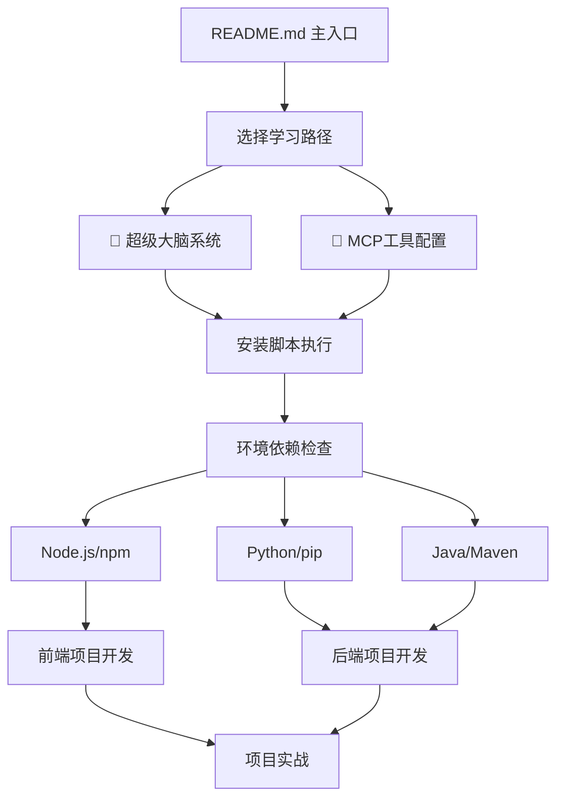

# 📚 Rules 2.3.1 文档体系分析报告

> **🎯 目标**: 系统化检查文档的逻辑层次和依赖关系，确保用户学习路径合理

## 🔍 当前文档结构分析

### 📁 文档分布

```
rules-2.1-optimized-2.2.1/
├── README.md                    # 主入口文档
├── USAGE.md                     # 高级使用指南
├── COMMANDS-REFERENCE.md        # 命令参考
├── tutorials/
│   ├── super-brain-system-usage-guide.md    # 🧠 核心智能系统
│   ├── frontend-rules-2.1-使用指南.md       # 🎨 前端详细教程
│   └── backend-rules-2.1-使用指南.md        # 🔧 后端详细教程
├── docs/
│   ├── MCP-QUICK-START-GUIDE.md             # 🔧 MCP快速入门
│   ├── MCP-TOOLS-INTRODUCTION.md            # MCP工具介绍
│   ├── MCP-DETAILED-CONFIG-GUIDE.md         # MCP详细配置
│   ├── MCP-INTELLIGENT-USAGE-STRATEGY.md    # MCP智能使用策略
│   └── MCP-TROUBLESHOOTING-GUIDE.md         # MCP故障排除
└── install-scripts/
    ├── INSTALL-GUIDE.md         # 📦 详细安装指南
    └── *.bat                    # 安装脚本
```

## 🎯 依赖关系分析

### 🔗 核心依赖链



### ⚠️ 发现的问题

#### 1. 🔄 **循环依赖问题**
- **问题**: README.md → 超级大脑系统 → 需要MCP工具 → 需要环境配置 → 回到详细教程
- **影响**: 用户可能在不同文档间跳转，找不到明确的起点
- **建议**: 建立清晰的线性学习路径

#### 2. 📦 **环境依赖前置不明确**
- **问题**: 超级大脑系统和MCP工具都需要Node.js环境，但没有明确说明
- **影响**: 用户可能在使用过程中遇到"npm命令不存在"等错误
- **建议**: 在核心文档开头明确环境要求

#### 3. 📚 **文档重复内容过多**
- **问题**: 前后端教程都包含相同的Node.js安装步骤（约60%重复）
- **影响**: 维护成本高，用户阅读体验差
- **建议**: 提取公共部分到独立文档

#### 4. 🎯 **学习路径不够清晰**
- **问题**: 用户不知道应该按什么顺序阅读文档
- **影响**: 新手容易迷失，高级用户找不到重点
- **建议**: 建立分层的学习路径

## 💡 优化建议

### 🎯 建议的新学习路径

```
阶段1: 环境准备 (5分钟)
├── 检查系统要求
├── 安装Node.js (必需)
└── 验证环境

阶段2: 快速安装 (3分钟)
├── 下载Rules 2.3.1
├── 运行安装脚本
└── 验证安装

阶段3: 核心功能 (10分钟)
├── 激活超级大脑系统
├── 学习基本命令
└── 完成第一个示例

阶段4: 工具增强 (5分钟)
├── 配置MCP工具
├── 测试智能功能
└── 个性化设置

阶段5: 深入使用 (按需)
├── 高级配置
├── 企业部署
└── 故障排除
```

### 📝 文档重构建议

#### 1. 创建统一的环境配置文档
```
新建: docs/ENVIRONMENT-SETUP.md
内容: Node.js、Python、Java等环境的统一安装指南
引用: 所有其他文档引用此文档，避免重复
```

#### 2. 简化README.md
```
保留: 项目介绍、快速开始、文档导航
移除: 详细安装步骤（移至专门文档）
优化: 突出核心价值和学习路径
```

#### 3. 重构教程文档
```
super-brain-system-usage-guide.md (保持，作为核心)
├── 专注于智能系统使用
├── 包含实战示例
└── 链接到环境配置文档

frontend/backend-rules-使用指南.md (降级为参考)
├── 移除重复的环境配置部分
├── 专注于技术栈特定内容
└── 作为深度参考文档
```

#### 4. 优化MCP文档结构
```
MCP-QUICK-START-GUIDE.md (保持，简化)
├── 快速配置步骤
├── 基本功能验证
└── 链接到详细文档

其他MCP文档 (整合)
├── 合并相似内容
├── 按使用场景分类
└── 减少文档数量
```

## 🚀 实施计划

### 第一阶段: 环境依赖梳理
1. 创建统一环境配置文档
2. 更新README.md的环境要求说明
3. 修改超级大脑系统指南，添加环境检查

### 第二阶段: 学习路径优化
1. 重新设计README.md的文档导航
2. 在每个文档开头添加"前置要求"说明
3. 建立清晰的文档间跳转链接

### 第三阶段: 内容去重
1. 提取前后端教程的公共部分
2. 简化MCP相关文档
3. 统一文档格式和风格

### 第四阶段: 验证测试
1. 邀请新用户按新路径测试
2. 收集反馈并优化
3. 完善故障排除文档

## 📊 预期效果

- ✅ **学习效率提升50%**: 清晰的线性学习路径
- ✅ **维护成本降低30%**: 减少重复内容
- ✅ **用户体验改善**: 明确的依赖关系和前置要求
- ✅ **新手友好**: 从环境配置到实际使用的完整指导
- ✅ **高级用户便利**: 快速定位到需要的高级功能

---

**📅 创建时间**: 2025-08-05  
**🔄 更新状态**: 待实施  
**👤 负责人**: AI助手  
**📋 优先级**: 高