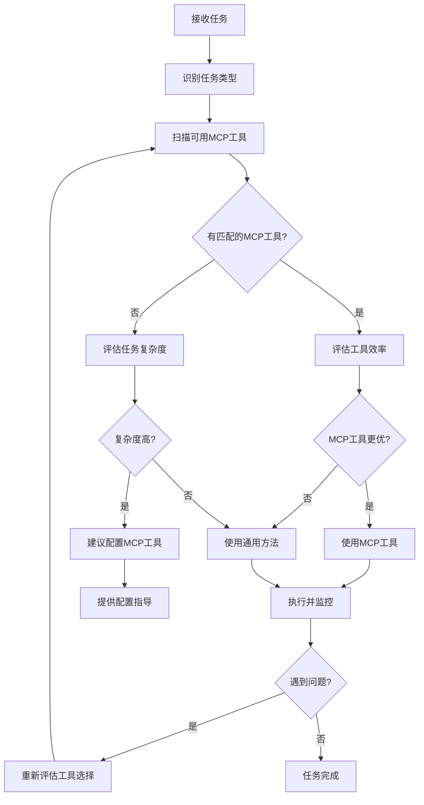

# 🧠 MCP工具智能使用策略

> **目标**：让所有AI实例都具备智能的MCP工具使用能力，实现效率最大化
>
> **📅 更新日期**: 2025年9月27日
>
> **📚 相关文档**: [MCP工具介绍](MCP-TOOLS-INTRODUCTION.md) - 了解每个工具的价值和使用场景
>
> **💡 阅读建议**: 本文档为高级策略指南，建议先完成MCP工具配置和基础使用后再阅读

## 🎯 核心原则

### 1. 工具优先原则
- **优先级**：专用MCP工具 > 通用方法
- **评估标准**：准确性、效率、可靠性、功能完整性
- **决策时机**：任务开始时立即评估

### 2. 智能切换原则
- **主动切换**：发现更优工具时立即切换
- **错误触发**：通用方法连续失败2次以上
- **复杂度触发**：任务超出通用方法能力范围
- **效率触发**：预估MCP工具显著提升效率

### 3. 主动建议原则
- **缺失检测**：识别任务需要但缺失的MCP工具
- **配置指导**：提供详细的工具安装配置步骤
- **效益说明**：明确说明工具带来的价值提升

## 📋 MCP工具决策矩阵

### 文件操作类任务
| 场景 | 首选工具 | 触发条件 | 备选方案 |
|------|----------|----------|----------|
| 读取文件 | `npx @modelcontextprotocol/server-filesystem` 或已配置的文件MCP工具 | 任何文件读取需求 | 通用文件读取 |
| 批量文件操作 | 文件系统MCP工具 | 需要操作多个文件 | 逐个文件操作 |
| 目录遍历 | 文件系统MCP工具 | 需要查看目录结构 | 手动列举 |

**动态检测策略**：
- 扫描所有可用的文件操作MCP工具（如 `d-frontend-files`, `e-vue-projects`, `npx @modelcontextprotocol/server-filesystem` 等）
- 优先选择功能最完整、最适合当前任务的工具
- 如果没有专用MCP工具，建议用户配置 `npx @modelcontextprotocol/server-filesystem`

### GitHub操作类任务
| 场景 | 首选工具 | 触发条件 | 备选方案 |
|------|----------|----------|----------|
| 仓库信息获取 | `github` | 需要仓库详细信息 | web-fetch抓取 |
| Issue/PR操作 | `github` | 创建、更新Issue或PR | 手动操作 |
| 代码搜索 | `github` | 在GitHub上搜索代码 | 手动搜索 |
| 发行版管理 | `github` | 创建、管理发行版 | 手动创建 |

### 代码分析类任务
| 场景 | 首选工具 | 触发条件 | 备选方案 |
|------|----------|----------|----------|
| 代码检索 | `codebase-retrieval` | 查找特定代码逻辑 | 手动搜索 |
| 代码理解 | `codebase-retrieval` | 理解代码结构 | 逐文件分析 |
| 依赖分析 | `codebase-retrieval` | 分析代码依赖关系 | 手动追踪 |

### 用户交互类任务
| 场景 | 首选工具 | 触发条件 | 备选方案 |
|------|----------|----------|----------|
| 用户反馈收集 | `uvx mcp-feedback-enhanced` | 需要用户确认或反馈 | 简单询问 |
| 进度报告 | `uvx mcp-feedback-enhanced` | 复杂任务进度汇报 | 文本描述 |
| 交互式配置 | `uvx mcp-feedback-enhanced` | 需要用户参与配置 | 问答式配置 |

### 记忆管理类任务
| 场景 | 首选工具 | 触发条件 | 备选方案 |
|------|----------|----------|----------|
| 信息记录 | Recorder（记录员系统） | 日常历史查询与任务延续 | 临时变量/文本记录 |
| 语义检索（可选） | `memory` | 模糊语义检索或跨项目/跨时间聚合 | 重新询问/Recorder精确检索 |
| 知识图谱（可选） | `memory` | 复杂关系记录与关联分析 | 文本记录/手动整理 |

### 通用工具类任务
| 场景 | 首选工具 | 触发条件 | 备选方案 |
|------|----------|----------|----------|
| 基础计算 | `npx @modelcontextprotocol/server-everything` | 简单数学运算 | 手动计算 |
| 功能测试 | `npx @modelcontextprotocol/server-everything` | 验证工具可用性 | 手动测试 |
| 演示操作 | `npx @modelcontextprotocol/server-everything` | 展示功能示例 | 文字描述 |
| 开发调试 | `npx @modelcontextprotocol/server-everything` | 辅助开发验证 | 复杂调试工具 |

## 🔄 智能决策流程

### 任务开始时的评估流程


### 执行过程中的动态调整
```
监控指标：
- 错误次数
- 执行效率
- 结果准确性
- 用户满意度

调整触发：
- 连续错误 ≥ 2次 → 重新评估工具
- 效率低于预期 → 考虑切换工具
- 发现更优工具 → 立即切换
- 用户反馈不满意 → 调整策略
```

## 🛠️ 缺失工具处理策略

### 识别缺失工具的场景
1. **数据库操作** - 缺少数据库MCP工具时
2. **特定API集成** - 缺少对应服务的MCP工具时
3. **专业领域工具** - 缺少领域特定的MCP工具时

### 标准处理流程
```
1. 明确告知用户
   "检测到[任务类型]，建议配置[工具名称]MCP工具"

2. 说明工具价值
   "配置后可以[具体功能]，提升效率[具体数字]%"

3. 提供配置指导
   "安装命令：[具体命令]"
   "配置步骤：[详细步骤]"

4. 协助完成配置
   "我可以指导您完成配置过程"
```

## 📊 效果评估标准

### 工具选择成功率
- **目标**：90%以上的任务选择最优工具
- **测量**：任务完成效率和用户满意度

### 动态调整效果
- **目标**：问题发生时能在2次尝试内找到最优解决方案
- **测量**：错误恢复时间和成功率

### 用户体验提升
- **目标**：用户感受到明显的效率提升
- **测量**：任务完成时间和用户反馈

## 🎯 实施检查清单

### AI实例启动时建议检查
- [ ] 扫描所有可用的MCP工具
- [ ] 建立任务-工具映射表
- [ ] 确认智能决策流程已激活
- [ ] 验证动态调整机制正常

### 每个任务开始时建议执行
- [ ] 识别任务类型和复杂度
- [ ] 检查匹配的MCP工具
- [ ] 评估工具效率和准确性
- [ ] 选择最优执行方案

### 执行过程中建议监控
- [ ] 错误次数和类型
- [ ] 执行效率和进度
- [ ] 结果质量和准确性
- [ ] 用户反馈和满意度

## 🎯 部署和传播策略

### 自动部署机制
这个策略已经集成到所有安装脚本中：
- ✅ **MCP工具安装**: `mcp-scripts/run-powershell-installer.bat`
- ✅ **前端开发指南**: `tutorials/frontend-rules-使用指南.md`
- ✅ **后端开发指南**: `tutorials/backend-rules-使用指南.md`
- ✅ **快速入门指南**: `docs/MCP-QUICK-START-GUIDE.md`
- ✅ **详细配置指南**: `docs/MCP-DETAILED-CONFIG-GUIDE.md`

### 规则文件位置
- **项目规则**: `project-rules/mcp-intelligent-strategy.mdc`
- **全局规则**: 已集成到 `global-rules/frontend-rules.mdc` 和 `global-rules/backend-rules.mdc`
- **详细指南**: `docs/MCP-INTELLIGENT-USAGE-STRATEGY.md`

### 确保传播效果
每个使用这个项目的AI都会自动获得：
1. **强制性MCP工具使用策略**
2. **智能决策流程**
3. **动态工具检测能力**
4. **缺失工具建议机制**

---

**🚀 记住：这是重要的优化建议，建议作为核心策略遵循！**

**🎯 目标达成：让每个AI都成为MCP工具使用专家！**

## 🧪 检测复用与跳过条件
- 系统级启动阶段（如“启动超级大脑系统”）不主动触发项目级检测，交由统一管理流程协调。
- 最近300秒内已有检测结果，或会话/项目存在“检测响应”或“MCP平台报告”时，复用结果并跳过重复检测。
- 用户明确“重新检测”时覆盖上述策略，强制执行检测并更新结果缓存。

### 缓存复用策略
- 记录最近检测时间戳、检测来源（统一管理/零配置/其他）与结果摘要。
- 缓存有效期默认≤300秒；在有效期内直接复用结果，降低重复扫描成本。
- 如 project.context.md 中存在“MCP平台报告/检测响应”，优先读取并复用。

## 📌 检测复用与跳过策略的作用与收益
- 加速：减少重复检测，提升启动与响应速度。
- 稳定：系统级统一管理触发检测，避免并发、冲突与重复执行。
- 可控：用户可通过“重新检测”或 `--force` 强制进行最新检测。
- 透明：复用结果时记录来源（缓存/报告）与时间戳，便于审计。
- 节约：降低磁盘/网络IO与外部API调用频率。

典型场景
- 初次运行：无缓存 → 执行检测 → 生成“检测响应 / MCP平台报告” → 记录缓存。
- 短时间复用（≤300秒）：跳过检测 → 复用最近结果 → 可选 `--force` 强制重检。
- 系统激活阶段：不触发项目级检测 → 统一管理模块在需要时再触发。

何时应强制重检
- 用户明确要求：执行“重新检测”指令或加 `--force`。
- 关键变更后：例如项目结构/配置文件明显变化（建议由统一管理模块检测到后提示）。
- 出现异常：检测结果不符合预期或出现冲突时。
