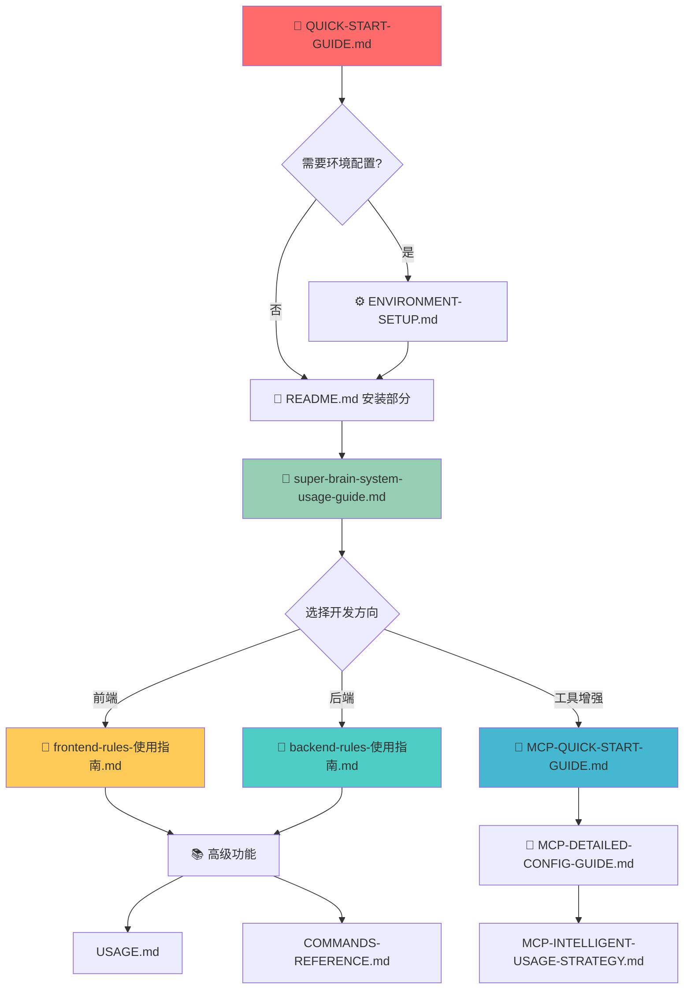

# 📚 AgentRules 文档导航索引

> **🎯 目的**: 解决文档间循环依赖，提供清晰的导航结构  
> **📋 原则**: 每个文档都有明确的前置要求和后续路径

## 🗺️ 文档依赖关系图



## 📋 文档分类和职责

### 🚀 入门级文档 (新手必读)

| 文档 | 职责 | 前置要求 | 后续路径 |
|------|------|----------|----------|
| **QUICK-START-GUIDE.md** | 5分钟快速上手 | 无 | → 环境配置 或 直接安装 |
| **README.md** | 项目概览和安装 | 快速开始指南 | → 超级大脑系统 |
| **ENVIRONMENT-SETUP.md** | 环境依赖配置 | 无 | → README安装部分 |

### 🧠 核心功能文档

| 文档 | 职责 | 前置要求 | 后续路径 |
|------|------|----------|----------|
| **super-brain-system-usage-guide.md** | 核心智能系统 | 完成安装 | → 选择专业方向 |
| **USAGE.md** | 高级使用指南 | 基础功能熟悉 | → 命令参考 |
| **COMMANDS-REFERENCE.md** | 命令速查手册 | 基础使用经验 | 开发时查阅 |

### 🎨 专业开发文档 (内容完整，不可修改)

| 文档 | 职责 | 前置要求 | 内容特点 |
|------|------|----------|----------|
| **frontend-rules-使用指南.md** | 前端开发完整教程 | 超级大脑系统 | 包含完整环境配置 |
| **backend-rules-使用指南.md** | 后端开发完整教程 | 超级大脑系统 | 包含完整环境配置 |

> **📝 重要说明**: 专业开发文档内容完整独立，包含重复的环境配置是为了确保用户可以独立使用任一教程。

### 🔧 MCP工具文档

| 文档 | 职责 | 前置要求 | 后续路径 |
|------|------|----------|----------|
| **MCP-TOOLS-INTRODUCTION.md** | MCP工具价值介绍 | 无 | → MCP快速入门 |
| **MCP-QUICK-START-GUIDE.md** | MCP快速配置 | 核心系统激活 | → MCP详细配置 |
| **MCP-DETAILED-CONFIG-GUIDE.md** | MCP详细配置 | MCP基础配置 | → 智能使用策略 |
| **MCP-INTELLIGENT-USAGE-STRATEGY.md** | MCP智能策略 | MCP详细配置 | 高级应用 |
| **MCP-TROUBLESHOOTING-GUIDE.md** | MCP故障排除 | 遇到问题时 | 问题解决 |

### 📚 参考文档

| 文档 | 职责 | 使用时机 |
|------|------|----------|
| **frontend-guide.md** | 前端开发参考 | 需要快速参考时 |
| **backend-guide.md** | 后端开发参考 | 需要快速参考时 |
| **intelligent-system/** | 智能系统详细文档 | 高级配置时 |

## 🔄 解决循环依赖的策略

### ✅ 已实施的解决方案

1. **线性学习路径**: README.md现在提供清晰的1-5步线性路径
2. **明确前置要求**: 每个阶段都有明确的前置条件
3. **分层导航**: 入门→核心→专业→参考的层次结构
4. **问题导向**: 提供"遇到问题时的查找顺序"

### 📋 导航原则

1. **单向依赖**: 文档间只有单向引用，避免循环
2. **就近原则**: 相关信息尽量在同一文档中
3. **独立完整**: 专业教程保持内容完整性
4. **快速定位**: 提供多种查找路径

## 🎯 用户使用建议

### 🔰 新手用户
```
QUICK-START-GUIDE.md → README.md安装 → super-brain-system-usage-guide.md
```

### 🚀 有经验用户
```
README.md → 选择专业方向 → 对应教程
```

### 🔧 问题排查
```
问题现象 → MCP-TROUBLESHOOTING-GUIDE.md → 对应解决方案
```

### 📚 深度学习
```
基础教程 → USAGE.md → COMMANDS-REFERENCE.md → 智能系统文档
```

## 📊 文档重复内容说明

### 🎯 设计理念
- **教程独立性**: 每个专业教程都是完整的，可以独立使用
- **用户体验**: 用户不需要在多个文档间跳转就能完成学习
- **内容完整性**: 重复的环境配置确保教程的完整性

### 📋 重复内容分布
- **环境配置**: frontend/backend教程都包含Node.js等环境配置
- **基础概念**: 各教程都有AgentRules的基础介绍
- **安装步骤**: 部分教程包含完整的安装流程

### ✅ 为什么保持重复
1. **独立使用**: 用户可以直接使用任一教程
2. **学习连贯**: 不需要频繁跳转查看其他文档
3. **内容完整**: 每个教程都是完整的学习资源

---

**📅 创建时间**: 2025-01-30  
**🎯 目的**: 解决文档导航和循环依赖问题  
**📋 原则**: 保持教程内容完整，优化导航结构  
**🔄 更新**: 随项目发展持续优化
| **MCP-QUICK-START-GUIDE.md** | MCP快速配置 | 核心系统激活 | → MCP详细配置 |
| **MCP-DETAILED-CONFIG-GUIDE.md** | MCP详细配置 | MCP基础配置 | → 智能使用策略 |
| **MCP-INTELLIGENT-USAGE-STRATEGY.md** | MCP智能策略 | MCP详细配置 | 高级应用 |
| **MCP-TROUBLESHOOTING-GUIDE.md** | MCP故障排除 | 遇到问题时 | 问题解决 |

### 📚 参考文档

| 文档 | 职责 | 使用时机 |
|------|------|----------|
| **frontend-guide.md** | 前端开发参考 | 需要快速参考时 |
| **backend-guide.md** | 后端开发参考 | 需要快速参考时 |
| **intelligent-system/** | 智能系统详细文档 | 高级配置时 |

## 🔄 解决循环依赖的策略

### ✅ 已实施的解决方案

1. **线性学习路径**: README.md现在提供清晰的1-5步线性路径
2. **明确前置要求**: 每个阶段都有明确的前置条件
3. **分层导航**: 入门→核心→专业→参考的层次结构
4. **问题导向**: 提供"遇到问题时的查找顺序"

### 📋 导航原则

1. **单向依赖**: 文档间只有单向引用，避免循环
2. **就近原则**: 相关信息尽量在同一文档中
3. **独立完整**: 专业教程保持内容完整性
4. **快速定位**: 提供多种查找路径

## 🎯 用户使用建议

### 🔰 新手用户
```
QUICK-START-GUIDE.md → README.md安装 → super-brain-system-usage-guide.md
```

### 🚀 有经验用户
```
README.md → 选择专业方向 → 对应教程
```

### 🔧 问题排查
```
问题现象 → MCP-TROUBLESHOOTING-GUIDE.md → 对应解决方案
```

### 📚 深度学习
```
基础教程 → USAGE.md → COMMANDS-REFERENCE.md → 智能系统文档
```

## 📊 文档重复内容说明

### 🎯 设计理念
- **教程独立性**: 每个专业教程都是完整的，可以独立使用
- **用户体验**: 用户不需要在多个文档间跳转就能完成学习
- **内容完整性**: 重复的环境配置确保教程的完整性

### 📋 重复内容分布
- **环境配置**: frontend/backend教程都包含Node.js等环境配置
- **基础概念**: 各教程都有AgentRules的基础介绍
- **安装步骤**: 部分教程包含完整的安装流程

### ✅ 为什么保持重复
1. **独立使用**: 用户可以直接使用任一教程
2. **学习连贯**: 不需要频繁跳转查看其他文档
3. **内容完整**: 每个教程都是完整的学习资源

---

**📅 创建时间**: 2025-09-25
**🎯 目的**: 解决文档导航和循环依赖问题  
**📋 原则**: 保持教程内容完整，优化导航结构  
**🔄 更新**: 随项目发展持续优化